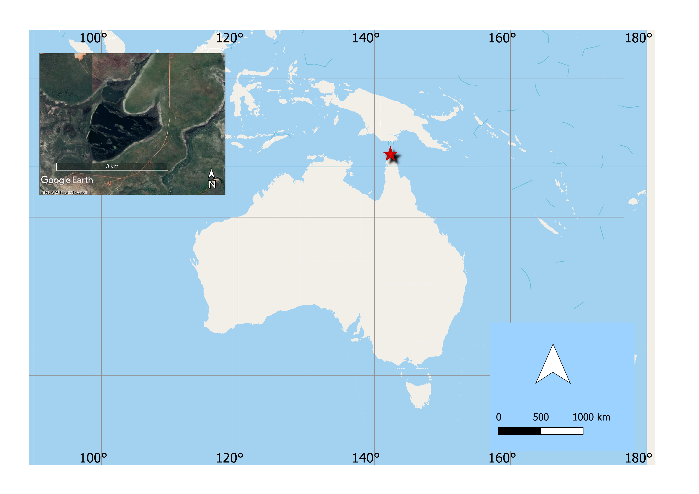
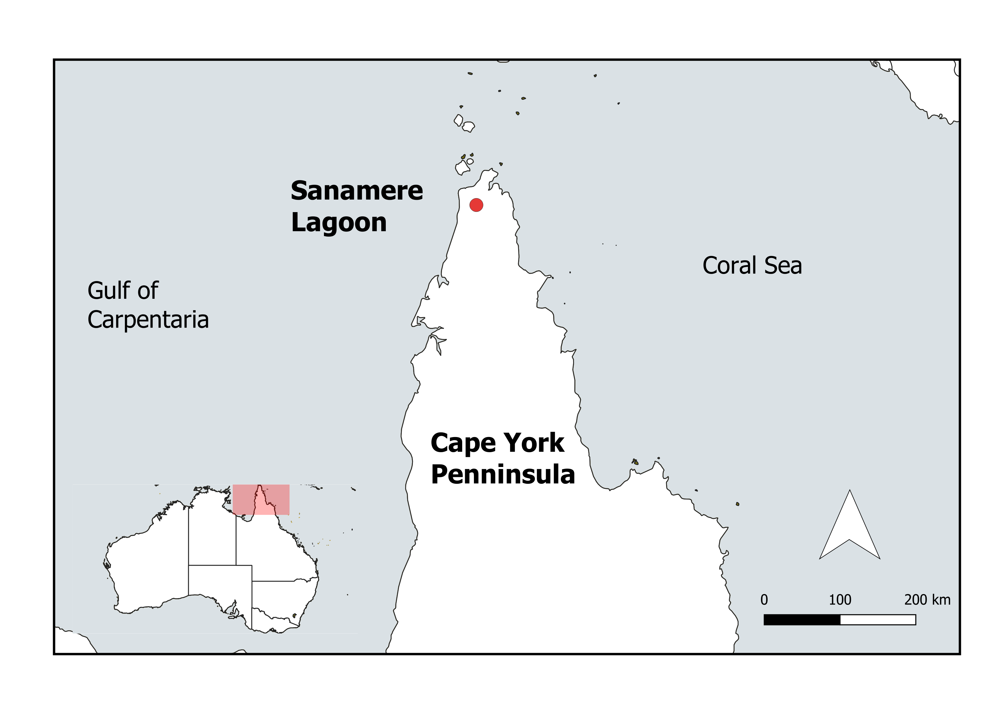
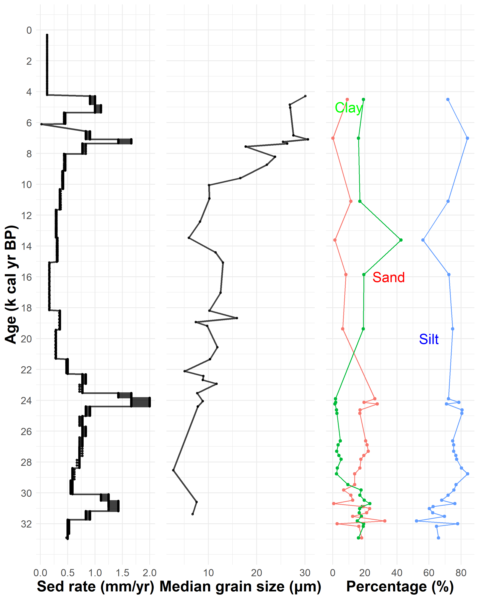
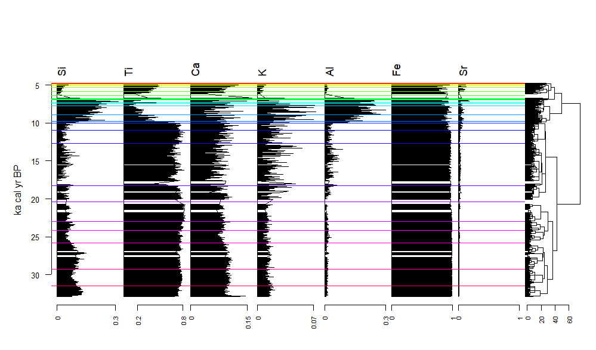
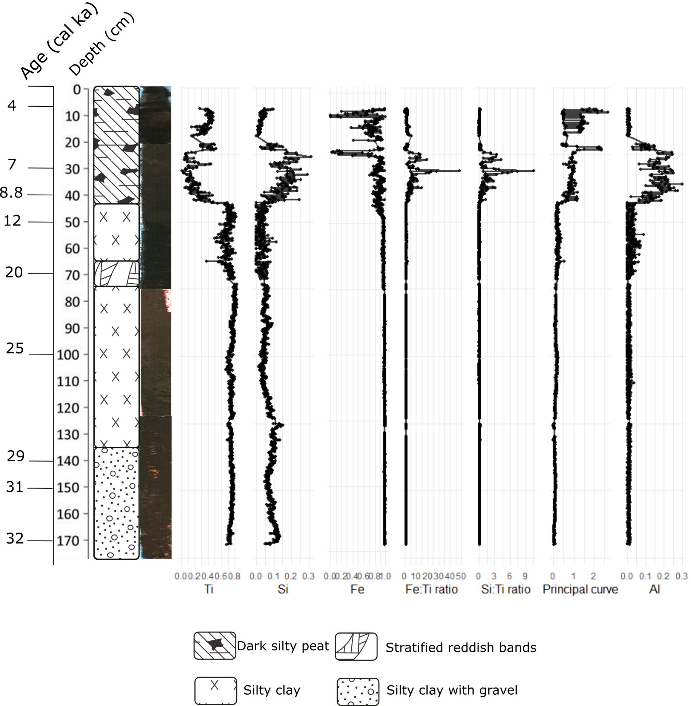
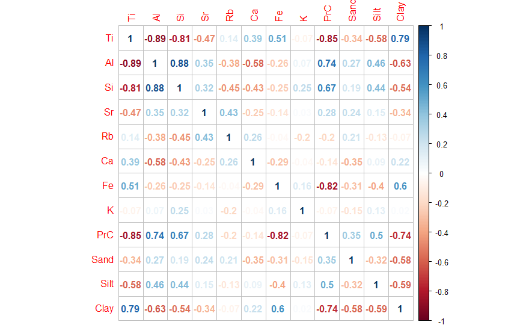
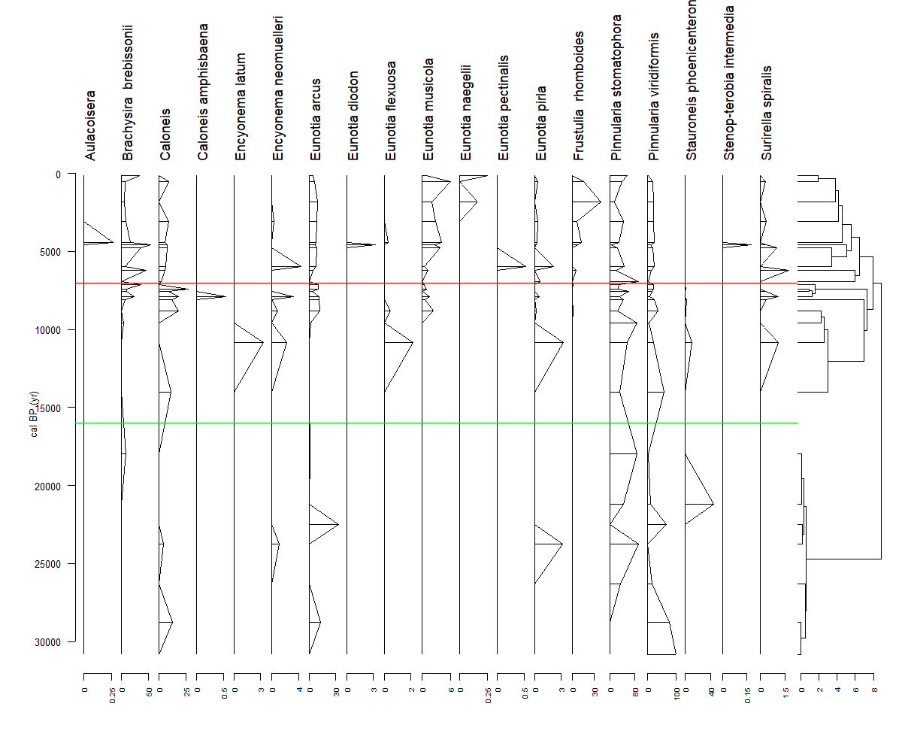
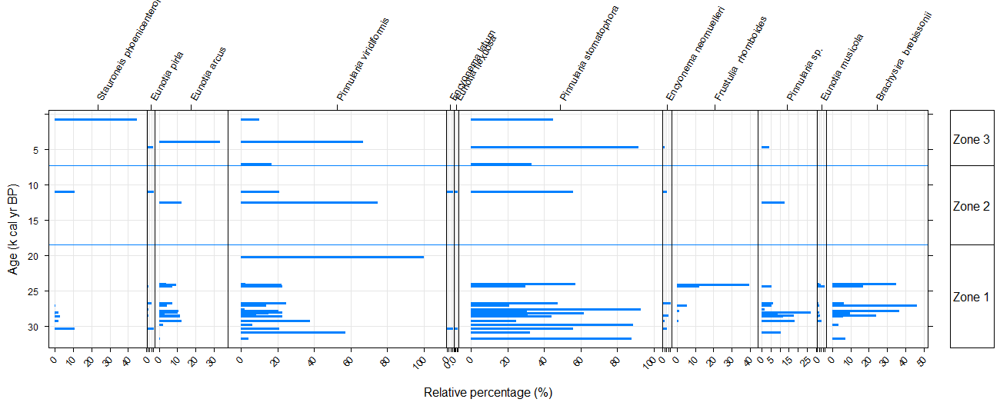
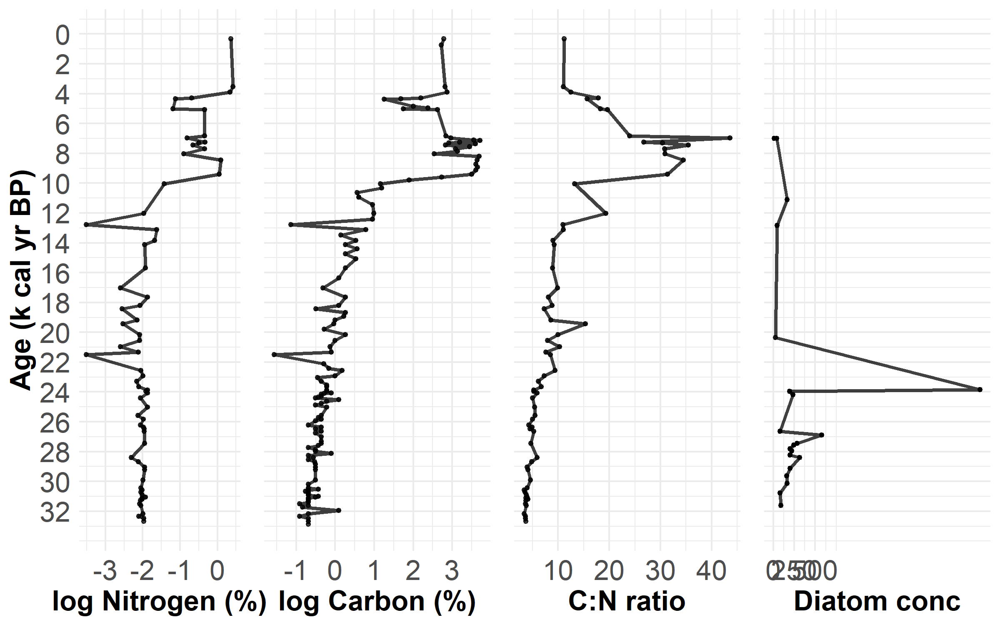
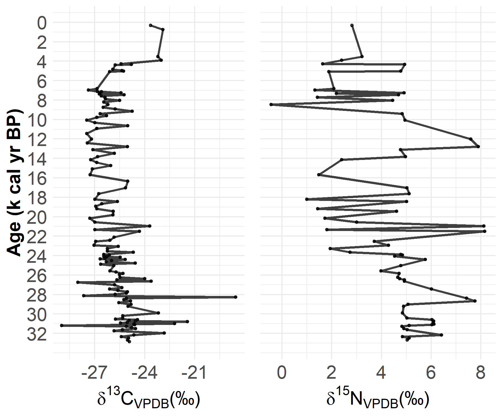

# 33,000 years of paleohydrological record from Sanamere Lagoon, northeastern tropical savannas of Australia {#ch:hydrology}

```{r hydrology, echo = FALSE, cache = FALSE, include = FALSE}
library(knitr)
library(here)
library(bookdown)
read_chunk('C:/Users/Maria Jose Rivera/OneDrive - James Cook University/Australia renamed/Sanamere/Thesis sections/PhD/analysis/Radiocarbon/an_radiocarbon-LAPTOP-3NCFQGAR.R')

#JUNE
# ADD diatoms photos and more references Cassie email

#MAYBE DELETE tb-one-pre from here so it can compile
# source of OM and interpretation ************
#Include this when discussing late Holocene, SAN is more like an exception: This seems to be part of a broader east to west trend, with a shift to
#moister and more stable conditions (i.e. more permanent
#water) at ca 2700 cal. BP in southeast Cape York Peninsula
#(Stephens and Head 1995), after 2500 cal. BP in the Torres
#Strait (Rowe 2007), after 1000 cal. BP on Groote Eylandt
#(Schulmeister 1992), and after 1300 cal. BP at Black Springs
#in the Kimberley (McGowan et al. 2013). However, there
#are several notable exceptions. Witherspoon Swamp is
#interpreted as shifting to drier not wetter conditions after
#2000 cal. BP (Moss et al. 2012), while Three-Quarter Mile
#Lake in northeast Cape York is interpreted as wet and stable
#from 5000 cal. BP to the present (Luly et al. 2006).


#IMPORTANT::: CHANGE CALONEIS AND ADD VAN DAM REFERENCE/ Taffs says caloneis is Pinnularia update!
## where are the figures!
#Fig 1: in PhD/Figs
##Fig 2: pre_grain.R in preprocessing at the end and plot_frac for percentages
##Fig 4: pre_gran, but coming form pre_ITRAX (prc) look for prcurve_ITRAX3 and so on (line 213)
#Cor plot in pre_grain together4, m4
# diatom in pre_diatoms.R
# include total of samples for diatoms
### Discussion

#table with units and last figure (geochemical)
#CO2 concentrations during LGM
#cal BP or cal ka yr BP
#?????sea level before 30 ka
#?? productivity vs primary productivity
#? include nitrogen isotopes and rainfall in discussion
#?C:N ratios vs isotopes algae 5 to 8 vs C3 low lake productivity, little algae
#?mention changes in fire/veg

#maybe include nitrogen composition from savanna paper, photos
#changes: new 'numbers' with new age model update agedepth2 vs ages_ITRAX can lead to slighlty diff results

#read_chunk((here("analysis", "Radiocarbon", "an_radiocarbon-LAPTOP-3NCFQGAR.R")))
#setwd("C:/Users/Maria Jose Rivera/OneDrive - James Cook University/Australia renamed/Sanamere/Thesis sections/PhD-thesis-VC/writeup")
###not know why if EVAL=TRUE in chunk with ggplot knitting to word does not work
```

```{r load-pkg1,echo = FALSE, cache = FALSE, include = FALSE,evaluate=FALSE}

#r load-pkg here before

```
## Introduction

The three main drivers of northern Australia climate are the Indonesian-Australian summer monsoon (IASM), the position of the Intertropical Convergence Zone (ITCZ) and the dynamics of the Indo-Pacific Warm Pool (IPWP) [@krauseSpatiotemporalEvolutionAustralasian2019; @risbeyRemoteDriversRainfall2009]. Our current knowledge of how environmental change have impacted these regions and their hydrological processes in the past is limited [@chiangTropicsPaleoclimate2009; @metcalfeQuaternaryEnvironmentalChange2012]. One region exhibiting gaps in long-term hydrological understandings are the tropical savannas of north Australia. Here, gaps are evident both temporally and methodologically The longest continuous, terrestrial record from this region to date only covers the last 14.5 ka yr [@fieldLateQuaternaryRecord2017], and even in this instance, the availability of proxies is limited by the poor preservation conditions to which samples are exposed [@fieldCoherentPatternsEnvironmental2018]. There is also a disparity in the location of records, with most coming from lowland coastal sites [e.g. @proskeHoloceneRecordCoastal2014; @proskeHoloceneFreshwaterWetland2016; @prebbleHolocenePollenDiatom2005]. The few records from northeast Australia (Cape York Peninsula) begin during the middle Holocene, and are also limited to one or two proxies per study [@proskeHoloceneDiatomRecords2017a; @lulyHolocenePalaeoenvironmentsChange2006]. This situation differs from the wet tropics, and particularly the Atherton Tablelands, where several studies have revealed the climatic and environmental conditions that prevailed during the last 50 ka yr [e.g. @turneyGeochemicalChangesRecorded2006a; @haberle23000yrPollen2005; @mullerPossibleEvidenceWet2008a; @burrowsNewLateQuaternary2016a; @kershawAustraliaSouthwestPacific2012]. However, this data is not representative of the savanna lowlands. 

Biogeochemical records derived from lake sediments have proven useful across a range of geographical areas within the tropics to recognize changes in climate, precipitation and anthropogenic activities [@meyersLacustrineSedimentaryOrganic1999; @lengPalaeoclimateInterpretationStable2004]. Lake sediments are useful because they integrate catchment wide fluctuations in both terrestrial and aquatic processes over long timescales [@cohenPaleolimnologyHistoryEvolution2003]. Especially relevant are records with robust dating, consistent and quality preservation of proxies and with little or no human imprint. @catalanGlobalChangeRevealed2013 demonstrated aquatic ecosystem and organism (such as diatom) response to diverse lithological and nutrient inputs as they reflect climatic changes. The combination of several proxies provides the opportunity to validate and interrogate current hypotheses regarding the trajectory of past environmental change [@birksMultiproxyStudiesPalaeolimnology2006]. 

Studies from the northern Australian tropics report conflicting evidence regarding the timings and intensity of monsoon peak activity over the glacial and the LGM and its reactivation during the deglacial. For example, records west from Cape York Penninsula, including stalagmite oxygen isotope records from West Flores in Indonesia show wet conditions over tropical Australia during the Last Glacial Maximum [@ayliffeRapidInterhemisphericClimate2013], while other stalagmite records and multi-proxy comparisons indicate drier conditions [@dennistonDecouplingMonsoonActivity2017; @dinezioEffectSeaLevel2013a]. There are also some discrepancies around the impact of climate change during Heinrich Stadials, and the relative intensity of the monsoon specially during the Middle and Late Holocene (7 ka cal yr BP), a time phase known to show a high degree of variability [@lewisHighresolutionStalagmiteReconstructions2011]. 

This paper presents the first, continuous terrestrial record covering the last ~33 ka of environmental change from the lowland tropics of northern Australia. Our site, Sanamere Lagoon, is located close to the tip of Cape York, northeastern Australia. We present a lake sediment record, combining geochemical (micro X-ray fluorescence [$\mu$XRF] scanning, carbon and nitrogen content and associated stable isotopes, physical (grain size) and biological (diatoms) proxy data sets. This study aims to develop a record of hydroclimatic changes in an under-studied region of northeast Australia.

## Site description

Cape York Peninsula is located on the northeastern Queensland coast of Australia between 10°S and 16°S. It is one of the major monsoon-influenced regions of Northern Australia, along with the Western Australia's Kimberley region and the Northern Territoruy Top End (Arnhem Land). The Peninsula is dominated by a strongly seasonal tropical climate (tropical savanna) [@peelUpdatedWorldMap2007], with just a small area of wetter climate (tropical monsoon) on the eastern coast. Perennial lakes are scarce in the entire area given the high evapotranspiration rates and the limited rainfall over most of the year. This feature of the Peninsula is a limitation for the study of long-term environmental change, meaning long records of past environments are particularly valuable.

Sanamere Lagoon (11.123°S 142.359°E; 15 m asl) is located close to the northern tip of Cape York Peninsula. The lagoon is 1 km north of the W-E flowing perennial Jardine River (Figure \@ref(fig:fighydro1)). The climate of the region is monsoonal with 88 % of the annual 1753 mm rainfall falling between December and April with a mean annual temperature of 27° C [@bureauofmeteorology2020]. Although most lakes dry out in this region during the dry season (May - Nov), the Water Observations from Space dataset [@muellerWaterObservationsSpace2016] indicates that the deeper parts of Sanamere lagoon have been permanently covered by standing water for the last 35 years, despite periods of signicantly below average rainfall in this period. The water depth during the dry season is 1.2 m for most of the lake. At this level, several relict dune features are exposed, dating from the time of lagoon impoundment. The lake was probably formed as a result of the collapse of laterite karst [@grimes2008laterite]. During the wet season, these features are largely submerged and the lake outflows into the Jardine River. The immediate lagoon area is dominated by an open sedgeland and *Pandanus*. The modern catchment vegetation includes *Asteromytus*, *Jacksonia*, *Hibbertia*, *Thryptomene*, *Allocasuarina* and *Grevillea*, while Eucalytus woodlands, and in lesser extent grasses, are also found around the catchment [@neldnerVegetationSurveyMapping1995]. 

```{r fighydro1,out.width = '80%', fig.align = "center", fig.cap = "(ref:fighydro1)",echo=FALSE}

#


```
(ref:fighydro1) Location of Sanamere Lagoon in Cape York

## Methods

### Sample collection and stratigraphy

In July 2017 a sediment core from Sanamere Lagoon was recovered from the deepest portion of the waterbody in a single drive from a raft-mounted hydraulic coring rig. In total 172.2 cm of sediment was collected, later cut in four even sections. A portion of each section was scanned at the Australian Nuclear Science and Technology Organisation (ANSTO) using the ITRAX $\mu$XRF core scanner, and the rest was sub-sampled at 1 cm resolution for the remainder of the analyses. 

Sediment differentiation was made on the basis of the physical features (darkness, stratification and texture), colour, structure, visible components (organic fragments, charcoal). Lithological unit limits were identified by examining individual elements (Si, Ca, Ti, Mn, Fe, Rb, Sr) (ITRAX $\mu$XRF core scans) [@schnurrenbergerClassificationLacustrineSediments2003].

### Chronology

A robust chronology was built using 13 sediment samples of varying organic content that were extracted from the core and dated using radiocarbon dating (chapter 5). We selected the samples following visible stratigraphic changes in the sequence. Carbon fractions included polycyclic aromatic carbon (SPAC), bulk organics and charcoal, which were pre-treated using hydrogen pyrolysis (hypy), 30 % hydrogen peroxide plus acid-base-acid (ABA) and standard ABA, respectively (chapter 5). Ages were obtained by accelerator mass spectrometry (AMS) at the VEGA and ANTARES facilities at ANSTO [@finkANTARESAMSFacility2004]. All results are reported as percent modern carbon (pMC) and as conventional radiocarbon ages (yr BP) following the conventions of Stuiver and Polach [@stuiverAtmosphericCarbonDioxide1978]. Radiocarbon ages were calibrated using the IntCal13 calibration data set [@reimerIntCal13Marine13Radiocarbon2013] in the Bayesian age depth modelling package Bacon, available in R [@blaauwRbaconAgedepthModelling2019]. Calibrated ages are displayed in cal. yr BP.

### Elemental analysis

ITRAX analyses provided information about the variation in elemental abundance downcore. High abundance of elements such as iron (Fe), titanium (Ti) and aluminum (Al) in lake sediments can indicate times of low lake level stands or greater material transport under conditions of higher precipitation and consequent runoff [@douglasMethodsFutureDirections2016]. XRF elemental profiles were completed for the four sections of the core (0-50, 50-100, 100-150, 150-172 cm), for the total of 172.2 cm, using the second-generation ITRAX core scanner located at ANSTO. Although the scanner produced data for a total of 25 elements (Al, Si, S, Cl, Ar, K, Ca, Ti, V, Cr, Mn, Fe, Ni, Cu, Zn, Br, Rb, Sr, Y, Zr, Pd, Ba, La, Ce, Pb), only those with above background measurements were selected for comparative and statistical analyses. In order to determine if a measurement was valid, the sample surface, argon and total counts were analysed for anomalous and/or inconsistent readings. The selected elements were normalized by calculating the proportion of counts of each element per total counts at each depth [@rothwellNewTechniquesSediment2006], and a ten-point running mean was calculated for the normalized concentrations. Fe:Ti ratios were calculated to document changes in redox conditions at the water-sediment interface, while Si:Ti ratios are a measurement of biogenic silica [@daviesMicroXRFCoreScanning2015]. 

Stratigraphic units were delineated using hierarchical clustering and a broken stick model using the packages vegan [@oksanenVeganCommunityEcology2019] and rioja [@jugginsRiojaAnalysisQuaternary2017], with Euclidean distance and constrained cluster analysis by the incremental sum of squares (CONISS) as the clustering method. The broken stick model separates the data into intervals and fts a separate line segment to each interval.

The $\mu$XRF core scanning was also summarized using a principal curve (PC). A PC is a generalized form of the first principal component axis of a dataset which takes the form of a curve, after being fitted through multiple dimensions [@simpsonStatisticalLearningPalaeolimnology2012].

### Grain size

Variability in grain size can indicate changing transport energy, lake levels, and the amount and energy of runoff into a sedimentary basin. The presence of larger grains in the sediment record indicates either increased precipitation (especially in closed-basin lake catchments) [@chenEnvironmentalRecordsLacustrine2004; @conroyHoloceneChangesEastern2008a] or lower lake stands resulting from higher accumulation of the nearshore components and weaker monsoon circulations [@xiaoHoloceneWeakMonsoon2009]. Thus, grain size can be used as an indicator for a pronounced water influx. Forty-two sediment samples were dispersed with sodium hexametaphosphate, sieved so particles < 1000 $\mu$m could be retained, subsequently pretreated with 30 % hydrogen peroxide to remove organics and finally with 1 M NaOH to dissolve biogenic silica particles. After this pretreatment, all samples were analysed using a Malvern Mastersizer 2000 laser diffraction spectrophotometer. The median grain size and the percentages of clay (< 2 $\mu$m), silt (> 2 $\mu$m and < 63 $\mu$m) and sand (> 63 $\mu$m) were obtained for each depth [@geeParticlesizeAnalysis1986]. A correlation matrix between grain size and elemental concentrations was calculated to explore the relationships between these variables.

### Diatoms

Diatoms are widely established indicators of paleoenvironmental conditions, demonstrating specific preferences for aquatic habitat types and water quality conditions [@battarbeeDiatoms2002; @stoermerDiatomsApplicationsEnvironmental2001]. On Cape York Penninsula, diatom composition has been previously correlated with total alkalinity, bicarbonate concentration, pH, electrical conductivity (EC) and latitude [@negusSubtleVariabilityWater2019]. This correlation confirms the potential of using these organisms as paleoclimate proxies in this area.
 
The core was sampled every second centimeter between 1 and 43 cm and every three centimeters there-after. Sample processing followed standard techniques [@morleyCleaningLakeSediment2004], including sample deflocculating, oxidation of organic matter by adding 30 % hydrogen peroxide, isolation of diatom frustules by adding heavy liquid (s.g. = 2.15), centrifuging for 15 minutes at 1500 rpm and then transferring the light fraction by pipette to a clean tube. Samples were diluted to 4 mL and an aliquot was transferred to a microscope slide to be counted using a Nikon Eclipse TE300 microscope. The volume in the tube and the volume pipetted in the slide were recorded, so the concentration of diatoms per sample could be calculated. Each sample was counted until at least a total of 300 complete valves were completed or a maximum of 10 transects was counted from each slide. Diatoms were identified using various taxonomic guides [@gellIllustratedKeyCommon1999; @sonnemanIllustratedGuideCommon1999]. The relative abundance of each species was calculated as a proportion of the total, and species representing less than 2 % of the relative abundance were removed to account for the influence of rare species. Raw diatom counts were converted to relative abundance before statistical analysis. Diatom autecology was established using published studies and databases [@whitmoreFloridaDiatomAssemblages1989; @carterNEWSPECIESEUNOTIA1988; @spauldingDiatomsNorthAmerica2010; @damCodedChecklistEcological1994; @potapovaDiatomNewTaxon2020].

### Carbon and nitrogen

The biochemical and organic matter composition of biota in a lake depends on the amount and type of organic matter deposited at different times in the history of a lake [@meyersOrganicGeochemicalProxies1997a]. The source of organic matter in the lagoon sediments was analysed using bulk sedimentary nitrogen and organic carbon isotope values, as well as the carbon to nitrogen (C:N) ratios. C:N ratios have often been used to distinguish the origins of sedimentary organic matter, with algae demonstrating ratios between 5 and 8 and vascular plants > 20. Ratios of ~10–20 mark the transition from primarily aquatic (< 10) to primarily terrestrial (> 20) organic matter [@meyersLacustrineOrganicGeochemistry1993; @meyersOrganicMatterAccumulation1995]. Carbon isotopes of terrestrial organic matter can be used to track variations in the availability of C3 and C4 plants, moisture and partial pressure of CO~2~. Carbon isotopes of algal organic matter also reflect the availability of dissolved CO~2~. Although nitrogen isotopes have been associated with several indicators (organic matter sources,past mixing regimes, the history of nutrient loading) [@brodieEvidenceBiasD13C2011a; @talbotNitrogenIsotopesPalaeolimnology2002], a possible inverse relationship between nitrogen isotope values and rainfall has also been suggested for the savannas in Northern Australia [@birdIdentifyingSavannaSignature2019].

A representative aliquot of each sample was homogenized using a mortar and pestle. Total organic carbon and nitrogen abundance and isotope composition of an aliquot of each ( 1–10 mg) were determined using a Costech elemental analyser fitted with a zero-blank auto-sampler coupled via a ConFloIV to a ThermoFinnigan DeltaV PLUS using continuous-flow isotope ratio mass spectrometry (EA-CF-IRMS) at James Cook University's Cairns Analytical Unit. Stable isotope results are reported as per mil (‰) deviations from the VPDB and AIR reference standard scale for $\delta$^13^C and $\delta$^15^N values respectively. Uncertainty on internal standards (‘Low Organic Carbon’ $\delta$^13^C −26.54 ‰, $\delta$^15^N 7.46 ‰; ‘Taipan’ $\delta$^13^C −11.65 ‰, $\delta$^15^N 11.64 ‰; and ‘Chitin’ $\delta$^13^C −19.16 ‰, $\delta$^15^N 2.20 ‰) was better than ±0.1 ‰. Repeated measurements on samples showed that C and N concentrations were generally reproducible to ±1 % (1$\sigma$).

## Results

### Stratigraphy

Physical characteristics, colour and structure are very homogenous along the 172.2 cm of the core (Figure \@ref(fig:fighydro56) and Figure \@ref(fig:fighydro4)). Silty, dark brown sediments dominate the whole sequence. A silty, organic-rich layer between 0 and 43 cm is clearly identifiable, with the presence of decomposed organic debri. From 43 cm, a marked decrease in organic content (to 1 %) is shown down-core whilst the sediment grain size decreases. Between 65 and 71 cm a series of sequential orange (7.5 YR 6/8) bands are evident, and silt and clay increase until 122 cm. Between 71 and 140 cm a brown, silty clay layer dominates the sequence. Starting at 140 cm a dark brown layer appears (7.5 YR 3/3), along with large pieces of rock, indicating the presence of bedload, while the carbon content remains low (Figure \@ref(fig:fighydro2)). A more detailed description of the stratigraphy is available in chapter 4.

### Chronology

The radiocarbon dating and the age model results are presented in Table \@ref(tab:tb-hy) and Figure \@ref(fig:fighydro3). Sedimentation rates change from 0.05 to 0.13 mm/year (32 - 24.6 cal ka yr BP) to 0.17 mm/year between 24.6 and 23.5 cal ka yr BP; range from 0.09 to 0.01 mm/year between 23.4 and 7.6 cal ka yr BP; to then maintain higher rates (0.09 to 0.15 mm/yr) onwards, with the exception at 4.9 cal ka yr BP, when they dropped abruptly (Figure \@ref(fig:fighydro2)). From 3.4 cal k yr BP sedimentation rates remained low (~ 0.01 to 0.09 mm/yr).

### Elemental abundance

High water content and low elemental counts prevented the use of the XRF scanning results between 0 – 7 cm (~ 4.2 cal ka yr BP). Cluster analysis identified 30 zones throughout the combined Sanamere profile (Figure \@ref(fig:fighydro44) and Table \@ref(tab:tb-units)). Fe is the most abundant element in the spectra, followed by Ti. Fe counts were stable and high until 10.8 cal BP from where they dropped. These counts fluctuated between 0.76 and 0.95 until they decreased abruptly to low values at 5.8 cal BP. After this, they increased again and fluctuated between 0.41 and 1 until they reached their lowest value at 4.8 cal BP, from which they peaked again at 4.5 cal BP (Figure \@ref(fig:fighydro44)). Fe counts were negatively correlated with Sr and Rb (Figure \@ref(fig:fighydro5)).

From the beginning of the sequence until 25.2 cal BP cm, Ti counts exhibited only minor fluctuations (values between 0.68 and 0.80). Fluctuating conditions increment after this period, with a gradual increase at 25.2 cal BP and an abrupt decrease at 17.6 cal BP. Counts increased at 16.6 cal BP and then decreased again at 14 cal BP, from where they reached 0.82 at 11.1 cal BP. From here, they declined at 7.2 cal BP and then increased at 5.9 cal BP, to finally drop to 0.28 at 4.5 cal BP. Ti counts were negatively correlated with Al counts.

Si counts had an increment at 28.8 cal BP, and gradually decreased until 12 cal BP, thereafter increasing to reach a peak around 7.5 cal BP, followed by an equally abrupt decrease. Fe:Ti ratios stayed low until ~9.8 cal BP from where they increased abruptly, with high values at 7.2 cal BP and 6.5 cal BP, decreasing thereafter. The $\mu$XRF data PC explained approximately 96 % of the total variance in the data set. Sr, Rb and Al show the highest positive correlation with the PC, whereas Ti and Fe display a significant negative correlation with this curve (r = -0.69) (Figure \@ref(fig:fighydro4)).

```{r fighydro2,out.width = '100%', fig.align = "center", fig.cap = "(ref:fighydro2)",echo=FALSE}

#include_graphics("other/Hydro/Second_draft/fig1.png")
# from pre_grain FINAL FIG 2
```

```{r tb-one-pre,echo = FALSE, eval=TRUE, include = FALSE,warning=FALSE}

```
(ref:fighydro2) Stratigraphy and geochemical parameters measured in the Sanamere sequence

```{r tb-hy,echo = FALSE, eval=TRUE, include = TRUE,warning=FALSE}
```
(ref:tb-hy) Conventional and calibrated dates used for the selected chronology

```{r fighydro3,out.width = '80%', fig.align = "center", fig.cap = "(ref:fighydro3)",echo=FALSE}

#include_graphics("other/Hydro/Second_draft/model_hypy.png")
#print(efinal)#from bacon SAN.R
include_graphics("other/Hydro/age_model.png")
```
(ref:fighydro3) Age-depth model

```{r fighydro44,out.width = '80%', fig.align = "center", fig.cap = "(ref:fighydro44)",echo=FALSE}

#include_graphics("other/Hydro/Second_draft/ITRAX_coniss2.png")
#include_graphics("cluster_graph.png")
#
#cluster_graph in pre_ITRAX
include_graphics("other/Hydro/ITRAX_clus.png")
```
(ref:fighydro44) Hierarchical cluster analysis and dendrogram with zones throughout the sedimentary profile 

```{r fighydro4,out.width = '80%', fig.align = "center", fig.cap = "(ref:fighydro4)",echo=FALSE}


#FIG 5 in pre_grain
```
(ref:fighydro4) Elemental ratios and principal curve 

```{r fighydro56,out.width = '50%', fig.align = "center", fig.cap = "(ref:fighydro56)",echo=FALSE}

#

include_graphics("Figs/150_200_a_cropped.png")
```
(ref:fighydro56) Sanamere core section (125 - 172 cm)

```{r tb-units,echo = FALSE, eval=TRUE, include = TRUE,warning=FALSE}
```
(ref:tb-units) Stratigraphical layers and units for the core

```{r fighydro5,out.width = '80%', fig.align = "center", fig.cap = "(ref:fighydro5)",echo=FALSE}


```
(ref:fighydro5) Correlation matrix between elemental counts, XRF principal curve (PrC) and grain size percentages

```{r fighydro6, fig.width=14,fig.height=8,echo=FALSE, fig.align="center", fig.cap="(ref:fighydro6)", out.width='80%'}

#
#print(BAR2_merge3) #pre_diatoms.Rmd
#
include_graphics("other/Hydro/my_species_plot.png") #from pre_diatoms
```
(ref:fighydro6) Diatom assemblage and concentration data 

```{r fighydro7,out.width = '80%', fig.align = "center", fig.cap = "(ref:fighydro7)",echo=FALSE,warning=FALSE}

#include_graphics("other/Hydro/Second_draft/geom.png")
#
#
#fig8 and fig8b from pre_grain
#geoochemical

#NEED TO REINCLUDE THIS!
#print(geom_fig) #from pre_grain
include_graphics("other/Hydro/geom_02_06.png")
```
(ref:fighydro7) Geochemical and diatom results for the Sanamere sequence. Note that % C and % N are presented as log-transformed values. 

### Grain size

Grains less than 35 $\mu$m dominated most of the Sanamere sequence (Figure \@ref(fig:fighydro2)). At 28.4 cal BP, clay increased to 45 %, while silt dropped to 56 %. Across the sequence, the sand percentage fluctuates between 0 % and 18 %, with exceptions at 18.6, 4.4 and 1.2 cal ka yr BP, where it increased to 27 - 32 %. After 9.6 cal BP, the clay percentage decreased while both sand and silt incremented. Sand content surpassed the clay percentage at 8.6 cal kyr BP and kept increasing until the top of the sequence. The silt fraction started to increase at 12.8 cal BP, from which it became the dominant fraction with 70 % of the total particles during the mid and late Holocene. The clay percentage broadly corresponded to the general trends seen in Ti counts (and was also correlated to the these counts) (Figure \@ref(fig:fighydro5)), with elevated clay percentages corresponding with high counts of Ti from the anatase in the laterite, which composes the fine fraction.

### Diatoms

The concentration of diatoms was low between the beginning of the sequence and 21.2 cal BP, from where there was a sustained increase until 14.4 cal BP. A peak in concentration is evident at 7 cal k yr BP, and the concentration decreased abruptly immediately after this peak to then increased and returned to early Holocene values at the top of the core (Figure \@ref(fig:fighydro6)).

A total of 19 diatom species were identified, with the assemblage dominated by benthic diatoms with a preference for acidic environments. The cluster analysis suggested the presence of three zones: ~ 33 – 18.4 cal BP, 18.4 – 7.3 cal BP and 7.3 – present. Until 18.4 cal BP, the sequence was mostly dominated by *Pinnularia viridiformis* and *Pinnularia stomatophora*, with *Stauroneis phoenicetron* and *Eunotia arcus* as secondary species. Around 18.4 cal BP, the abundance of additional species (such as *Brachysira brebissonii* and *Pinnularia sp.*) incremented, while *P. viridiformis* became less abundant compared to the previous period. The diversity of species started to increase around 11 cal BP, and particularly after 9.8 cal BP, when *Encyo-nema neomuelleri* and *Eunotia muscicola* appeared. The abundance of *B. brebissonii* increased, while *Pinnularia sp.* decreased. From 5.8 cal BP, *B. brebissonii* declined, while *Frustulia rhomboides* increased, and species such as *Eunotia diodon* and *Stenop-teoribia intermedia* appeared for the first time. A summary of the diatoms found in the core and the autecology associated with them is presented in Table \@ref(tab:tb-aut). 

### Carbon and nitrogen

A total of 134 samples were analyzed for carbon and nitrogen percentages and isotopes ($\delta$^13^C, and $\delta$^15^N). The C:N ratio shows a gradual, but substantial, increase along the sequence, changing from a value of 4 at 32 cal BP to 13 at 10 cal BP. At 6.9 cal k yr BP the highest ratio is reached (44). From this date, the ratio declines to 11 at the end of the sequence (Figure \@ref(fig:fighydro7)).

The percentage of carbon ranges between 0.2 and 41 %. It is consistent and low (0.3 – 1 %) during the period 33 to 17.9 cal BP. The period between 17.9 – 9.7 cal ka yr BP shows a sustained increment in the percentage of carbon from 1 % to 2.2 %, from where it gradually increases until 40 % at 8.1 cal BP. Values fluctuate between 40 and 13 % until a peak is reached at 7.1 cal k cal yr BP. From here, they gradually decreased to 3.5 % at 4.3 cal BP, to later increment to 16.7 % from 3.4 cal k yr BP.

Nitrogen percentages stayed low across the sequence, with a range between 0.03 and 1.52 %. Between 32 and 10 cal BP values remained between 0.03 and 1.2 %, from where they gradually increased and fluctuate between 1.1 and 0.3 until 4.9 cal BP. They increased and reached 1.4 and 1.5 % between 3.9 and 545 cal BP.

$\delta$^13^C values varied between -29.0 and -18.4 ‰. Spanning 32 and 22.8 cal BP, these values fluctuated from – 28.9 ‰ to - 27.6 ‰. At 20.9 cal BP they decreased and stayed around -26.5 ‰ until 4.7 cal BP. At this point they increased and fluctuated between -25.3 ‰ and -23.2 ‰ (9.8 – 4.4 cal BP). Values kept increasing to reach -23.6 ‰ at present cal BP (Figure \@ref(fig:fighydro7)).

$\delta$^15^N values varied between - 0.4 and 8.2 ‰. From 32 to 17.6 cal BP, these values tended to decrease from 7.8 ‰ to 1 ‰, from which they increased abruptly at 12.9 cal BP (7.6 ‰). Values kept fluctuating between -0.44 ‰ and 4.8 ‰ after 12.9 cal BP, without a clear trend (Figure \@ref(fig:fighydro7)).

## Discussion

The Sanamere sequence is one of a handful of sediment sequences older than 14 cal ka yr BP available for the dry tropics of Australia [@dennistonDecouplingMonsoonActivity2017; @dennistonNorthAtlanticForcing2013; @dedeckkerLateQuaternaryCyclic2001; @reevesSedimentaryRecordPalaeoenvironments2008]. Six stratigraphic layers were identified using physical and chemical evidence. Their corresponding paleoenvironmental conditions as described below. The biological (diatom) and geochemical (elemental abundance and grain size) evidence at Sanamere suggests that the lagoon was small and shallow between its formation and 9.8 cal BP. From 9.8 cal BP evidence shows an expansion in standing water. The C:N ratios suggest the dominance of aquatic plants from the lake formation until 12.4 cal ka yr BP from where the addition of terrestrial input is evident. 

### 33 - 29.2  cal ka yr BP

The age-depth model indicates sediments in Sanamere lagoon started to accumulate around ~ 33 cal ka yr BP. Initial accumulation is likely to have formed under dry climate conditions and low sea level stands [@brookePalaeoshorelinesAustralianContinental2017]. It is likely that during this time the site formed a shallow pond or swamp, given the low concentration and autecology of the diatoms and nutrients found at the base of the column. *P. viridiformis*, an aerophilous diatom, is the single dominant species during this period and is commonly found in neutral or acidic water, in epipelic and epilithic assemblages. Aerophilous species commonly occur in subaerial environments such as moist or temporarily dry places, to the point of surviving nearly exclusively outside water bodies [@johansenDiatomsAerialHabitats2010]. The C:N ratio values (< 20) suggest the input of aquatic plants, predominantly. Between 31.6 - 30.1 cal k yr BP, a possible wetter phase is suggested by the high sedimentation rates and possible runoff of clastic materials, with the highest percentage of clay in the sequence and an average particle size of 2.7 $\mu$m. Enriched values of $\delta$^15^N during this period also indicate a possible increase in productivity in the lake [@meyersLacustrineSedimentaryOrganic1999].

Infilling of Sanamere lagoon likely related to a wet expression of the Heinrich event 3 in the southern tropics, a hydrological response already recorded in tropical Australia and Brazil [@lewisHighresolutionStalagmiteReconstructions2011; @mullerPossibleEvidenceWet2008a; @turneyMillennialOrbitalVariations2004a]. High sedimentation rates observed between 31.3 and 30.1 cal BP support this trend. Although regional Australian reconstructions suggest drier and colder conditions, with the monsoon considered to be inactive, or greatly weakened at this time [@reevesPalaeoenvironmentalChangeTropical2013], other studies have proposed the presence of wet periods during the pre-glacial in Broomfield swamp [@burrowsNewLateQuaternary2016a] and Lynch’s Crater [@mullerPossibleEvidenceWet2008a] on the Atherton Tablelands. Noting with caution that these dates are  potentially overestimated [@mayRefiningLateQuaternary2015], extreme floods have been also identified during this period [@nottEarlyHoloceneAridityTropical1999], for example those recorded in Wangi waterfall in the Northern Territory during the pre-glacial [@nott30000Year1996;@nottPlungePoolsPaleoprecipitation1994].

### 29.1 - 19.8 cal ka yr BP

The period between 29.0 –19.8 cal BP appeared to be relatively stable, with little sedimentological or compositional changes recorded along the sequence. Minor site variation is seen in an increase in Si abundance between 30.2 - 27.1 cal ka yr BP, probably as a result of an inwash of silicates as part of a short-duration wet event. Diatoms appeared in slightly higher concentrations compared to the previous period. Species additional to *P.viridiformis* and *E.arcus* appeared for the first time, including *E.arcus* and *S. phoenicentron*. These are all acidophilous species recorded in habitats with running water [@damCodedChecklistEcological1994]. Carbon and nitrogen concentrations continued to be low, while the silicon and aluminium counts decreased after 27.1 cal ka yr BP. 

Besides the increase in median grain size (from 2 to 11 $\mu$m), there is not clear evidence of major arid or wet periods during this period. This stability is at odds with previous studies in the wet tropics of Australia, which have proposed the presence of wet phases and/or high variability and alternance between dry and wet periods [@burrowsNewLateQuaternary2016a], possibly derived from Heinrich events (23 -24 ka) [@mullerPossibleEvidenceWet2008a] while other regional studies in Indonesia have determined that these effects are not discernible [@tierneyNorthernHemisphereControls2008].

At Samanere, cooler conditions are suggested by a decrease in the $\delta$^13^C values during this period, which indicates a  rise in the availability of dissolved CO~2~. For instance, concentrations of CO~2~ available to algae are affected by surface water temperatures in oceans and lakes, increasing during cooler times and decreasing during warmer periods [@fogelIsotopeFractionationPrimary1993; @meyersOrganicGeochemicalProxies1997a].

### 19.8 – 18.2 cal ka yr BP

The period between 19.8 and 18.2 cal BP represents a drier phase around the lake. The titanium counts started to decrease at 19.8 cal BP, and more abruptly at 18 cal BP, indicating a lapse in the erosion activity derived from precipitation around the lagoon. The sedimentation reached its lowest rate, the median grain maintained the same size (11 $\mu$m), and the diatom concentration stayed as the previous period. Diatom species diversity decreased however, with only three species present: *P.stomatophora*, *P. viridiformis* and *B. brebissonii* (for the first time). These conditions suggest a particularly dry phase, with an irregular monsoon, although not the pronounced aridity other studies have proposed for this period [@hanebuthRapidFloodingSunda2000; @hesseLateQuaternaryClimates2004; @reevesPalaeoenvironmentalChangeTropical2013; @wyrwollInitiationAustralianSummer2001]. 

### 18.2 – 9.7 cal ka yr BP

Between 17.6 and 9.6 cal BP, the lagoon records the reactivation of the monsoon. For example, in a first phase (17.8 – 12.8 cal BP), the effects of a weaker monsoon are evidenced in the increased $\delta$^15^N, indicating an increment in the exogenous mineral and organic matter input into the lake. The decrease in Ti counts at 14 cal BP could be reflecting a substantial relative increase in lake level, which may be limiting the accumulation of detrital sediments in the center. The Ti counts had two phases of decline, at 18 and 13.9 cal BP. While during these two periods the Al and Si counts increased slightly, this may be due to the production of biogenic silica, evidenced by the diatom concentration and the Si:Ti ratio. This hypothesis is also supported by the increase in the C:N ratio, which suggests more terrigenous input into the lagoon. The slight increase in the Fe:Ti ratio during this period may be also indicating more availability of organic matter input into the lake. These Sanamere results support previously published regional results indicating the monsoon becoming active somewhere between 14 – 19 cal yr BP [@hanebuthRapidFloodingSunda2000; @hesseLateQuaternaryClimates2004; @reevesPalaeoenvironmentalChangeTropical2013; @wyrwollInitiationAustralianSummer2001; @fieldCoherentPatternsEnvironmental2018].

In a second site phase (12.8 - 9.7 cal BP), an increase in grain size, C:N ratios, carbon percentage, a peak in $\delta$^15^N and the elemental counts principal curve suggest a much stronger monsoon. The increase in sediment and carbon input into the lake suggests an increment in wet events resulting from an increase in rainfall. The change in the diatom assemblage around 10.8 cal BP with the appearance of *E.flexuosa*, *E. latum*, *E. neollimueri*, *E. pirla*, and *Surirella spiralis*, also indicates a change towards more productivity and further lake deepening at this time, as some of these species prefer stagnant water to grow (*E.flexuosa*, *E. latum*).

### 9.7 – 4.6 cal ka yr BP

Starting around 9.7 cal BP, there is an abrupt change in the geochemical and biological composition of the lagoon, which coincides with the “big swamp phase” identified in previous studies in northern Australia [@prebbleHolocenePollenDiatom2005a; @lulyHolocenePalaeoenvironmentsChange2006; @proskeHoloceneDiatomRecords2017a]. The increases in the carbon and nitrogen percentages, C:N ratio as well as the concentration of diatoms suggest a change in the origin of the terrigenous input in the lake towards a dominance of terrestrial plants, although the $\delta$^13^C and $\delta$^15^N values do not change significantly. The sand percentage begins to increase at 9.5 cal BP and it keeps this trend until the end of the sequence, which is an indication of stronger allochthonous input into the lagoon. The Fe:Ti and Si:Ti ratios increased until they reached a peak at 7.5 cal BP and the clay content dropped to 2.8 % from a previous value of 17 %. The new diatoms species such as *E.flexuosa*, *E.muscicola*, *E. latum* and *E. neomuelleri* suggest the expansion and deepening of the lagoon. The Ti counts dropped abruptly as the swamp expanded. Several sites across the Australian tropics have identified a period of increased precipitation around 7.9 ka [@shulmeisterHolocenePollenRecord1992; @haberle23000yrPollen2005], probably linked to increased monsoon activity between 11 and 7.5 ka [@fieldCoherentPatternsEnvironmental2018]. Sanamere is consistent with interpretations of wetter, less seasonal climatic conditions.

Indicators of increased precipitation continue after 7 cal BP, where carbon percentages, Fe:Ti and Si:Ti ratios keep rising. C:N ratios, median grain size and diatom concentrations reached their highest values at 7 cal BP. The clustering analysis in the ITRAX elemental abundance identified more frequent changes starting at 7 ka cal yr BP. Additionally, the increase in *B. brebissonii* at 7.3 ka cal yr BP suggests a shift towards water with lower pH.  

From 6.9 cal BP, a decline in precipitation is suggested by the decreased values in diatom concentration, Fe:Ti, C:N ratios and carbon percentages. High variability in the ITRAX elemental abundance, along with the high variability shown in the elemental counting principal curve resulted in the identification of a higher number of zones by the clustering approach compared to previous periods, which implies the recurrence of fluctuating wet-dry conditions.

This fluctuating wet-dry variability continued until 4.9 cal BP. After 4.9 cal BP C:N ratios declined to values below 20, indicating greater input from aquatic plants. The progressive increment in *F.rhomboides* starting at 4.9 cal BP, along with the decrease in carbon percentage, Fe:Ti ratio and the high sedimentation rates (between 4.9 and 4.2 cal BP), indicate a more permanent expansion and deepening of the lake body, probably as a consequence of an increased precipitation phase (and warmer temperatures) during this period, which caused an increase in primary productivity including nutrients, as well as turbidity levels and primary productivity [@hembrowDiatomCommunityResponse2014].

Although this response differs from the one seen at Big Willium in Weipa, which shows a very low sedimentation rate during this time period [@proskeHoloceneDiatomRecords2017a], previous studies have identified reduced summer monsoon activity and less effective precipitation during this phase [@dennistonStalagmiteRecordHolocene2013; @reevesPalaeoenvironmentalChangeTropical2013; @loughEvidenceSuppressedMidHolocene2014; @fieldCoherentPatternsEnvironmental2018]. This increase in sedimentation broadly corresponds with the global “4.2 ka event”, which has been associated with intense climatic variability in several locations around the globe [@marchantRapidEnvironmentalChange2004b; @perryGeophysicalArchaeologicalHistorical2000]. In tropical Australia, possible expressions of this event have been found in the Kimberley region [@dennistonStalagmiteRecordHolocene2013; @fieldUntanglingGeochronologicalComplexity2018] and the Gulf of Carpentaria [@shulmeisterHolocenePollenRecord1992].

### 4.6 cal ka yr BP – Present

Starting at 3.4 ka cal yr BP, a significant decline in sedimentation rates suggests a decrease in depositional events, although no information is available for changes in these processes as the elemental abundace record is not reliable after this period. While the decrease in C:N ratios implies a higher contribution of algae/aquatic plants into the lake. The diatom assemblage does not show any change during this period compared to the previous phase. 

The large ranges associated with the ages during this period along with the fact that the top 3 cm represent 2.7 years, rises the possibility of an hiatus caused by the removal of sediment by local scouring induced by the passable of a tropical cyclone. However, further analyses are required to test the feasibility of this hypothesis.

## Conclusions

The geochemical and biological evidence for a sediment core from Sanamere lagoon provides a record of 33 ka cal yr BP of environmental history for the tropical savannas of northern Australia. This record significantly extends the paleoenvironmental information for the Australian dry tropics through the LGM and pre-glacial periods, where there is a lack of terrestrial records. The use of multi-proxy evidence contributed to clarify the conflicting evidence around the consequences and impact of the changes in monsoon activity during the last 33 cal ka yr BP.

Six main periods of change were identified using evidence from stratigraphical changes, elemental abundance and diatom assemblages. The period between the lagoon impoundment (33 cal ka yr BP), and 31.6 ka cal yr BP was characterized by low erosional and biological activity. Between 31.6 - 30.1 ka cal yr BP, a wetter phase is suggested by higher sedimentation rates. The period 29 - 20 cal ka yr BP was marked to be drier and cooler, which agrees with the results from previous studies in the region. Between 20 - 17.8 ka cal yr BP the drop in Ti counts suggests a particular dry period. After 17.6 ka cal yr BP, the reactivation of the monsoon is suggested by the increased in nitrogen isotope values, the decline in Ti counts, changes in the diatom assemblage and C:N, Fe:Ti and Si:Ti ratios. The biological and geochemical evidence suggest a stronger monsoon starting at 12.8 ka cal yr BP evidence for a wetter phase increases, suggesting a stronger monsoon. These conditions further develop at 9.7 ka cal yr BP, from where strong evidence for a wetter phase and higher erosional and biological activity are consistent with the development of swamps in other areas in northern Australia.  

From 5.9 ka cal yr BP, fluctuations in the erosional and depositional conditions, and possibly precipitation are more frequent, coherent with the changing behavior reported for the monsoon during the Middle Holocene. Between 4.9 - 4.2 ka cal yr BP, high sedimentation rates and changes in the diatom assemblage and geochemical indicators suggest a deeping of the lake. The limited data after 3.4 ka cal yr BP reflects the absence of major transformations, but with a possible hiatus resulting from the effects of a cyclone.

```{r tb-aut,echo = FALSE, eval=TRUE, include = TRUE,warning=FALSE}

```
(ref:tb-aut) Autecology of diatoms found in the study

