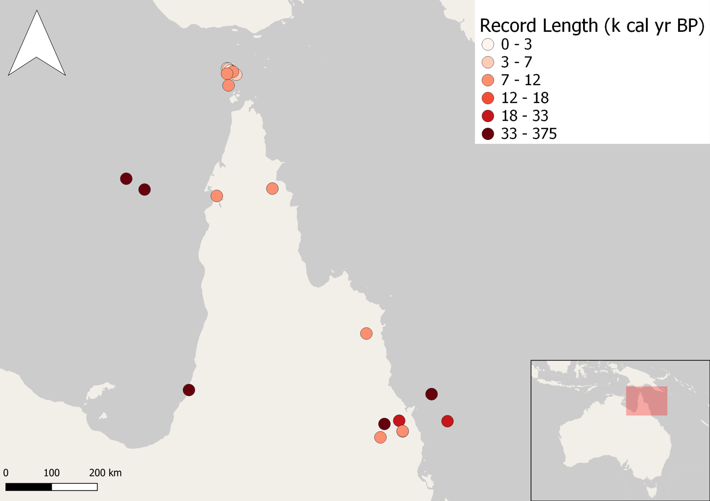
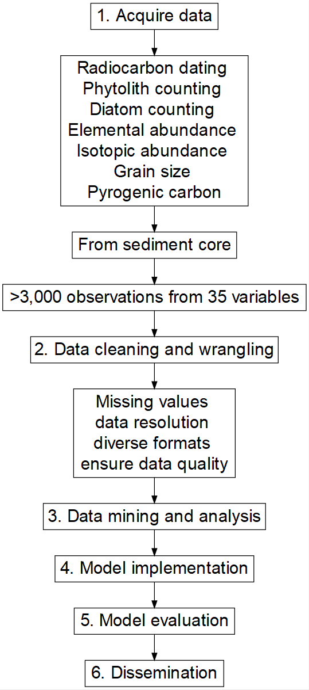
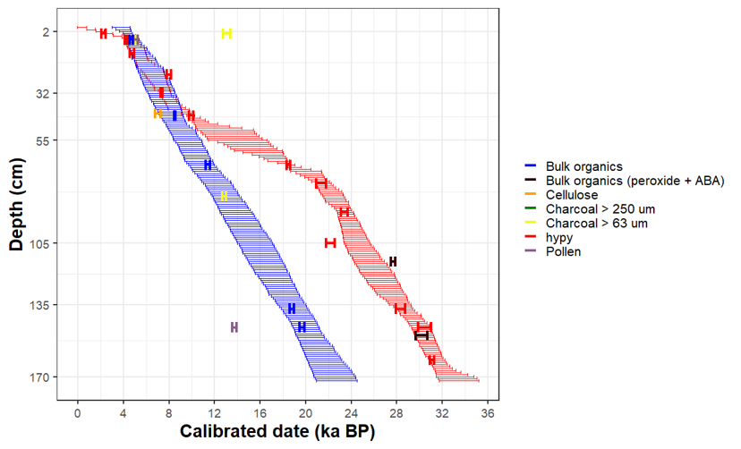

class: middle

# Statement of the problem

.pull-left[

Future climate projections require past data to feed models.

*But*

There is a lack of information about past climate and environmental change in northern Australia
]

.pull-right[


]

```{r setup, include=FALSE}
options(htmltools.dir.version = FALSE)
```

???

Image credit: [Wikimedia Commons](https://commons.wikimedia.org/wiki/File:Sharingan_triple.svg)

---
# Design a solution


1. Obtain ages for the sediments - Subproject 1

2. Identify and delineate periods of change - Subproject 2

---

class: center




---
class: inverse, center, middle

# Subproject 1
## How old is the core?

---
## Bayesian modelling to assign ages to the sediments in the core



---
class: inverse, center, middle

# Subproject 2
## Find environmental and climate changes across time


---
## Hierarchical clustering and PC to delineate periods of change


- Four main periods of environmental change were identified (33 - 29.1 ka, 29.1 - 18.2 ka, 18.2 - 9.7 ka and 9.7 ka - present).

- Regional climatic events, such as the reactivation of the monsoon and sea level rise are reflected in the local ecosystems along a diversity of biogeochemical responses.

---

class: inverse, center, middle

# Dissemination

- Thesis
- Github
- Publications under review
- Dataset with past environmental data to feed climate models (complying with FAIR data principles)


