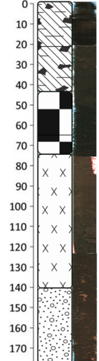
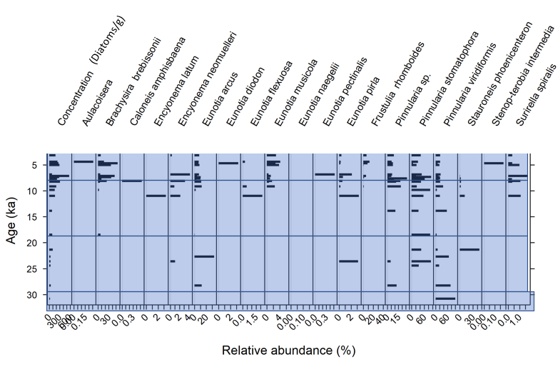

class: middle

# Statement of the problem

.pull-left[
- Spatial gaps

- Temporal gaps
]

.pull-right[


]

```{r setup, include=FALSE}
options(htmltools.dir.version = FALSE)
```

???

Image credit: [Wikimedia Commons](https://commons.wikimedia.org/wiki/File:Sharingan_triple.svg)

---
# Design a solution

.pull-left[
- A lot of data recorded in the sediments

- Chemical: nutrient and metal abundance

- Biological/ecological: fossils: algae, pollen
]

.pull-right[


]


---
class: inverse, center, middle

# Subproject 1
## How old is the core?

---
## Bayesian modelling to assign ages to the sediments in the core


---
class: inverse, center, middle

# Subproject 2
## Find environmental and climate changes across time


---
## Hierarchical clustering and PCA to delineate periods of change

- Water levels 
- pH





---
## Hierarchical clustering and PCA to delineate periods of change

- Erosion 


---
class: inverse, center, middle

# Final product

- Database of seven different environmental indicators and periods of time
- To be included in climate projections
- Implemented FAIR data principles

---

